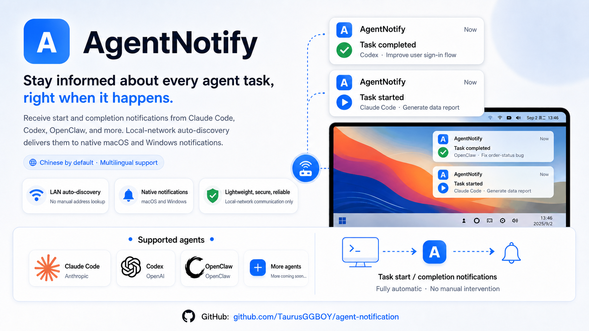

# Agent Notification

> [中文](README.md) | English

<p align="center">
  
</p>

<p align="center"><strong>Native desktop notifications for agent task status.</strong></p>

<p align="center">
  
  
  
</p>

AgentNotify is a local-network desktop notification receiver. Claude Code, Codex, OpenClaw, and other agents can send task-start and task-completion events to AgentNotify, which displays native macOS or Windows notifications.

The desktop app runs the local notification service, shows its LAN address, sends test notifications, manages launch-at-login behavior, and lets users switch the interface language. Agent-side setup is handled by the repository's `agent-notify-discovery` skill, so hook commands usually do not need to be written manually.

## Features

| Capability | Details |
| --- | --- |
| macOS and Windows desktop app | Tauri app with a bundled Go server sidecar |
| Native system notifications | Uses macOS and Windows notification centers |
| LAN auto-discovery | Advertises `_agent-notify._tcp.local.` through mDNS/DNS-SD |
| Multi-agent support | Claude Code, Codex, and OpenClaw, with room to extend |
| Task events | Configure `start`, `stop`, or both |
| Local control panel | Service status, LAN URL, setup guidance, history, and testing |
| Launch at login | Manage automatic startup in the desktop app |
| Chinese and English UI | Switch languages in application settings |

## Project layout

| Path | Purpose |
| --- | --- |
| `tauri-app/` | macOS and Windows desktop client |
| `windows-server/` | Go notification service bundled as the desktop sidecar |
| `skills/agent-notify-discovery/` | Agent auto-discovery and hook-configuration skill |
| `scripts/` | Installation, verification, and helper scripts |
| `docs/` | Release and maintenance documentation |

## Quick start

### 1. Install and start the desktop app

Download the installer for your platform from GitHub Releases.

For macOS, open the `.dmg`, drag `AgentNotify` to `Applications`, start it, and allow notifications when prompted. For Windows, run the installer, start `AgentNotify`, and allow local-network access if Windows Firewall or security software asks.

Send a test notification from the app to confirm that system notifications appear. After startup, it shows a LAN URL such as:

```text
http://192.168.1.23:17891
```

Agents can usually discover this address automatically. If multicast is unavailable or agents are on another subnet, use the URL shown by the app for manual configuration.

### 2. Install the AgentNotify skill

On the machine running your agents, install the repository skill:

```bash
npx skills add TaurusGGBOY/agent-notification
```

Then run:

```text
/agent-notify-discovery
```

Typical requests:

```text
Discover AgentNotify and configure task-completion notifications for Claude Code, Codex, and OpenClaw.
```

```text
Use http://192.168.1.23:17891 and configure start and completion notifications for Claude Code and Codex.
```

Restart Claude Code or Codex after configuration. Restart the OpenClaw Gateway for its plugin to take effect. If Codex asks you to trust hooks, review `~/.codex/hooks.json` before approving it.

### 3. Verify notifications

After restarting an agent, send a simple message such as `hi`. The desktop app should receive a native notification when the task completes, and also when it begins if `start` events were configured.

You can also test the service directly:

```bash
curl -X POST http://127.0.0.1:17891/notify \
  -H 'Content-Type: application/json' \
  -d '{"agent":"codex","event":"stop","project":"agent-notification","message":"manual test"}'
```

## Event mapping

| Agent hook | AgentNotify event |
| --- | --- |
| Claude Code `SessionStart` | `start` |
| Claude Code `Stop` | `stop` |
| Codex `SessionStart` | `start` |
| Codex `Stop` | `stop` |
| OpenClaw `before_model_resolve` | `start` |
| OpenClaw `agent_end` | `stop` |

## Notification protocol

AgentNotify accepts JSON requests at `POST /notify`:

```json
{
  "agent": "claude",
  "event": "start",
  "project": "agent-notification",
  "cwd": "/path/to/project",
  "message": "Task started",
  "timestamp": "2026-06-03T10:00:00Z"
}
```

| Field | Description |
| --- | --- |
| `agent` | Agent name, such as `claude`, `codex`, or `openclaw` |
| `event` | `start` or `stop` |
| `project` | Project name |
| `cwd` | Agent working directory |
| `message` | Notification body |
| `timestamp` | Event time; ISO 8601 is recommended |

## Troubleshooting

| Problem | What to do |
| --- | --- |
| No desktop notifications | Check system notification permission and send a test notification in AgentNotify |
| Agent cannot find the app | Configure the LAN URL shown in the app manually |
| LAN device cannot connect | Check firewall access to port `17891` |
| Hooks do not take effect | Restart the affected agent or OpenClaw Gateway |
| Codex asks to trust hooks | Review `~/.codex/hooks.json` before approving it |

## Development

Desktop client:

```bash
cd tauri-app
npm install
npm run tauri:dev
```

The command builds the Go sidecar for the current Rust target and starts the Tauri app.

Go service:

```bash
cd windows-server
go test ./...
go run .
```

The default address is `0.0.0.0:17891`. Override it when needed:

```bash
AGENT_NOTIFY_HTTP_ADDR=127.0.0.1:17891 go run .
```

## Release

See [docs/release-checklist.md](docs/release-checklist.md). Releases require a manual action; an ordinary merge does not create a release.
